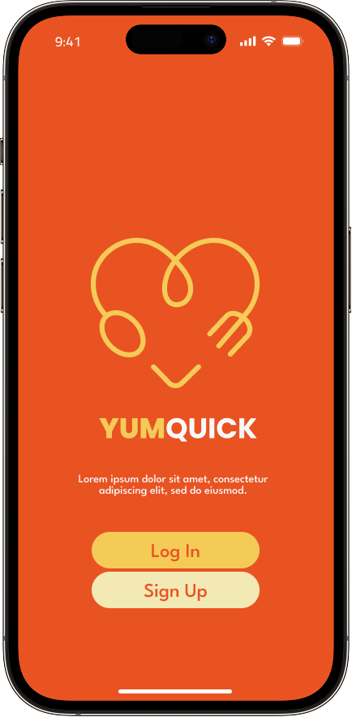
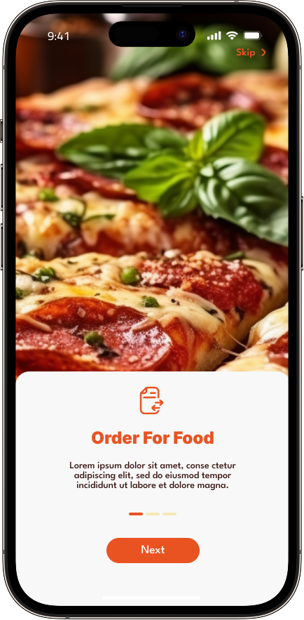
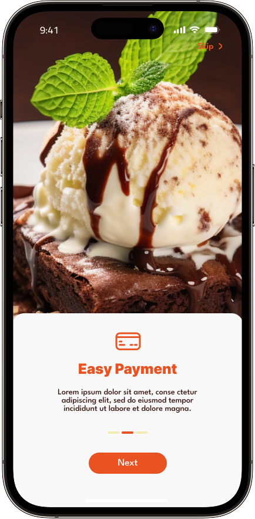
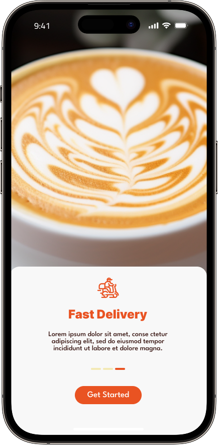
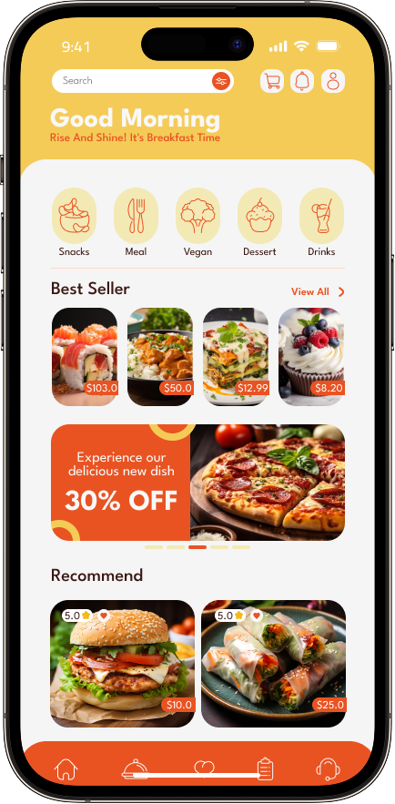
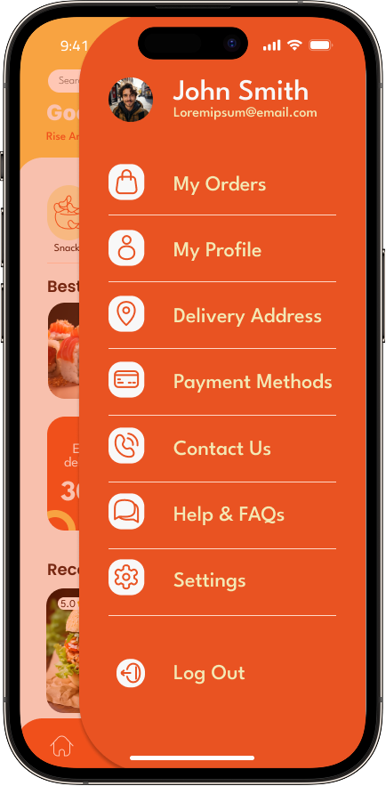
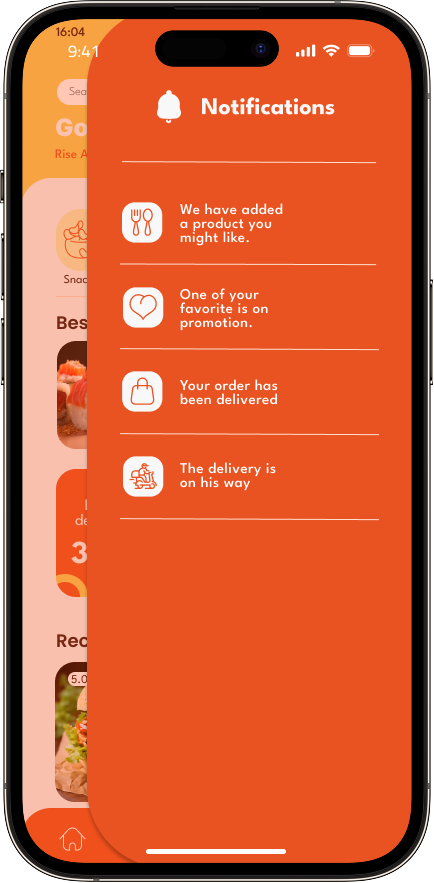
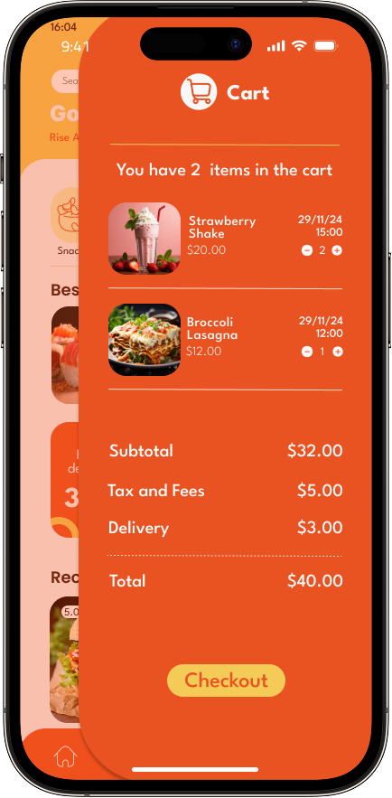
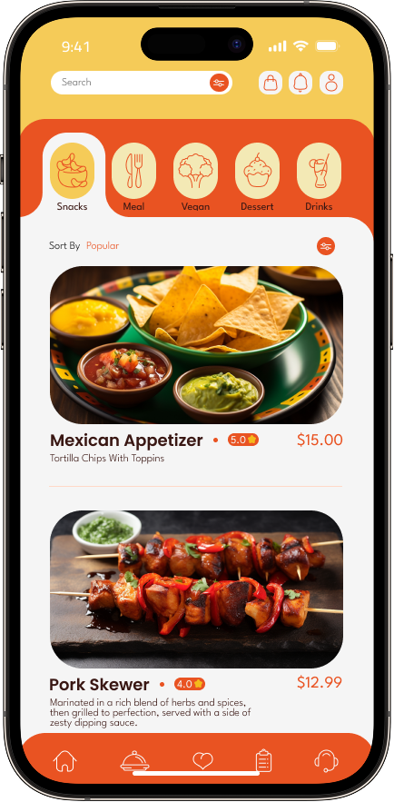
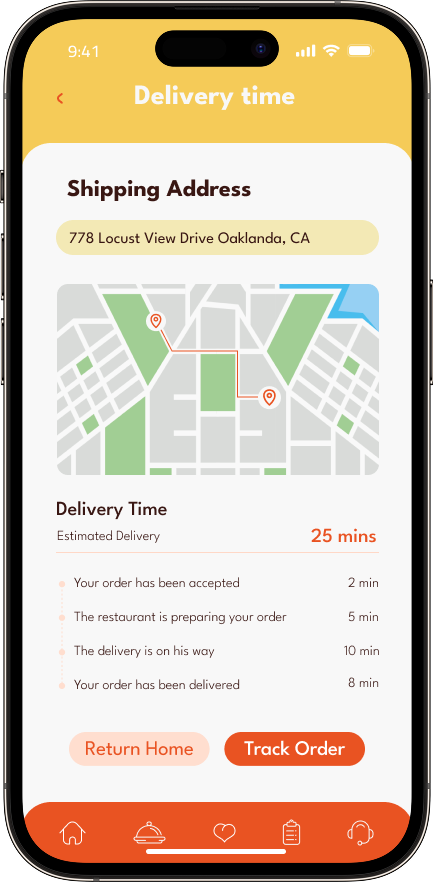

# 🍔 InstaFood  

InstaFood is a modern **food delivery app** built with Flutter.  
It allows users to browse multiple restaurants, choose their favorite meals, place an order, and track delivery time easily — all in one place.  
With built-in **account management, profile settings, and payment options**, InstaFood makes food delivery simple and seamless.  

---

## 🚀 Features  

- 📍 **Restaurants & Menus** – Browse multiple restaurants and explore their menus  
- 🍱 **Food Ordering** – Choose meals, customize your order, and add to cart  
- 🛒 **Cart & Checkout** – Smooth order placement process  
- ⏱ **Order Tracking** – Track delivery status and estimated arrival time  
- 👤 **User Profile** – Create and manage your personal account  
- 🏠 **Addresses** – Save and manage multiple delivery addresses  
- 💳 **Payment** – Manage payment methods (cash, card, wallet, etc.)  
- ⚙️ **Settings** – Customize app preferences  
- 🎨 **User-Friendly Design** – Simple and intuitive interface
- AI AGENT  SUPPORT
- شه 

---

## 🛠 Tech Stack  

- **Framework:** Flutter (Dart)  
- **State Management:** Bloc 
- **Backend/Database:** Firebase / HTMl APIs (https://fakerestaurantapi.runasp.net/)
- **Authentication:** Firebase Auth

---

## 📲 Getting Started  

Follow these steps to run the project locally. Choose Flutter-only or Full Stack.

### Option A — Flutter app only

```bash
# Clone the repository
git clone https://github.com/Salah-Essam/InstaFood.git

# Navigate to the project directory
cd InstaFood

# Install dependencies
flutter pub get

# Run the app on emulator or device
flutter run
```

### Option B — Full stack (Flutter + AI Agent)

This project includes an AI assistant backend (FastAPI + Gemini) under `agent_service/`. Below are end-to-end steps to run it and connect the app.

Note: Configuration is done via `agent_service/.env` (there is no `agent_services.json` in this repo).

1) Prerequisites

- Python 3.10+ installed
- Flutter SDK installed (and Android SDK for Android builds)
- Google AI Studio key for Gemini (GEMINI_API_KEY)
- Firebase service account JSON and matching `FIREBASE_PROJECT_ID`

2) Create and activate a virtual environment (Windows PowerShell)

```powershell
# From the repo root
python -m venv .venv
.\.venv\Scripts\Activate.ps1
python -m pip install --upgrade pip
pip install -r agent_service/requirements.txt
```

3) Configure the agent environment

Create `agent_service/.env` with your keys, for example:

```env
# Firebase
FIREBASE_PROJECT_ID=instafood-1
GOOGLE_APPLICATION_CREDENTIALS=C:\path\to\service-account.json

# Agent behavior
AGENT_FASTPATH=true
GEMINI_MODEL=gemini-1.5-flash
GEMINI_MAX_TOKENS=2048
GEMINI_API_KEY=YOUR_GEMINI_KEY
GEMINI_MAX_RETRIES=0
AGENT_WARM_LLM=false

# Items API base (used by the agent)
API_BASE_URL=https://fakerestaurantapi.runasp.net/api
```

4) Start the AI agent (FastAPI)

```powershell
# From the repo root (venv active)
uvicorn agent_service.main:app --host 127.0.0.1 --port 8787 --log-level info
# Health check (optional): http://127.0.0.1:8787/health
```

5) Connect the Flutter app to the agent

- Physical Android device over USB

```powershell
# Reverse the port so the phone reaches your PC localhost
adb reverse tcp:8787 tcp:8787

# Run the app and point it at the agent on 127.0.0.1
flutter run --dart-define=AGENT_BASE_URL=http://127.0.0.1:8787
```

- Android Emulator

```powershell
# Emulator maps host to 10.0.2.2 (no need for adb reverse)
flutter run --dart-define=AGENT_BASE_URL=http://10.0.2.2:8787
```

- iOS Simulator

```bash
flutter run --dart-define=AGENT_BASE_URL=http://127.0.0.1:8787
```

6) Troubleshooting and tips

- If the app can’t reach the agent, verify the URL and try these:
  - Physical device: ensure `adb reverse` succeeded and the agent is running on 127.0.0.1:8787
  - Emulator: use `http://10.0.2.2:8787`
  - Real device over Wi‑Fi: use your PC’s LAN IP, e.g., `http://192.168.x.y:8787`, and allow it through the firewall
- Useful endpoints:
  - GET `/health` → {"status":"ok"}
  - GET `/debug/auth` → Firestore connectivity probe
  - GET `/debug/llm_status` → AI cooldown/fast-mode status
  - POST `/chat` → { userId, message } → { reply }
- To conserve LLM quota during development: keep `AGENT_WARM_LLM=false` and `GEMINI_MAX_RETRIES=0`.
- Ensure `GOOGLE_APPLICATION_CREDENTIALS` points to a valid service account file.
- The agent writes orders to `users/{uid}/orders`; the app’s Firestore streams reflect changes live.

---

## 📸 Screenshots  

<p float="left">
  
  
  
  
  
  
  
  
  
  
</p>

<!-- Quick-start commands are shown in Getting Started above. -->

### Windows (PowerShell Admin) notes

If your device can’t reach the agent running on your PC, Windows Firewall may be blocking Python. You can add allow rules (run PowerShell as Administrator):

```powershell
# Allow the project venv Python to make outbound connections
netsh advfirewall firewall add rule name="Allow InstaFood Python Backend" dir=out action=allow program="C:\Users\Rowan\OneDrive\Desktop\collage\semester6\flutter\finalProject\InstaFood\.venv\Scripts\python.exe" enable=yes

# (Optional) Also allow system Python 3.12 outbound, if you run the agent with it
netsh advfirewall firewall add rule name="Allow Python 3.12 OUT" dir=out action=allow program="$env:USERPROFILE\AppData\Local\Programs\Python\Python312\python.exe" enable=yes
```

Environment variables (alternatives to `.env`): you can set them in the current PowerShell session. Prefer the `.env` file in `agent_service/`, but this can help for quick tests.

```powershell
# Use your actual service account JSON path (not agent_services.json)
$env:GOOGLE_APPLICATION_CREDENTIALS="C:\path\to\service-account.json"
$env:FIREBASE_PROJECT_ID="instafood-1"
$env:GEMINI_API_KEY="YOUR_GEMINI_KEY"
$env:GEMINI_MODEL="gemini-1.5-flash"
```

Notes:
- This repo does not include `agent_services.json`. Point `GOOGLE_APPLICATION_CREDENTIALS` to your Firebase service account JSON file, or use `agent_service/.env` which the agent loads automatically.
- Firewall rules above allow outbound traffic for the Python executable that runs the agent. If you bind the agent to a LAN IP and want inbound access from other devices, you may also need an inbound rule for the chosen port (8787 by default).
